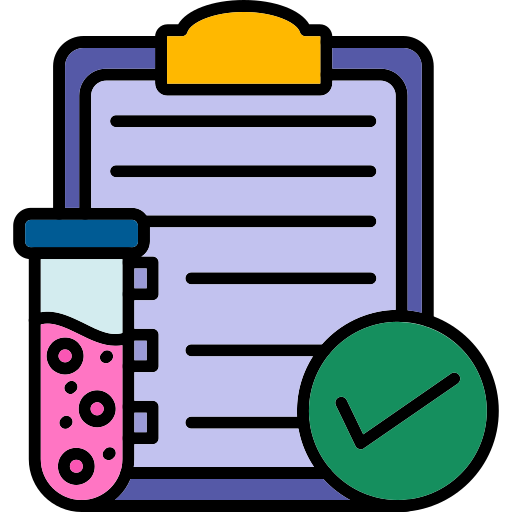

# Integração Whatsapp

  O projeto visa integrar o whatsapp ao sistema do IMREA-HC, fazendo com que ações como realização de agendamento, consulta de agendamento, resultado de exames e dúvidas pode ser acessado de maneira simples através de uma conversa pelo whatsapp(feita por chatbot). E também um sistema automatizado de envio de notificação ao usuário lembrando da consulta para que ele confirme ou cancele para que diminuam as faltas em consultas. E tudo feito de maneira simples, como se fosse uma conversa no whatsapp.

---

## Índice

- [Sobre](#sobre)
- [Funcionalidades](#funcionalidades)
- [Tecnologias Utilizadas](#tecnologias-utilizadas)
- [Instalação](#instalação)
- [Estrutura do Projeto](#estrutura-do-projeto)
- [Imagens e Ícones](#imagens-e-ícones)
- [Integrantes](#integrantes)
- [Links](#links)

---

## Sobre

Ele resolve problemas como dificuldades de acesso ao site oficial, e ao contato pelo telefone, fazendo com que o funcionamento fique mais fluido e simples. Facilitando aqueles com maior dificuldade com tecnologia, como idosos, a utilizar com maior facilidade o sistema. E um novo sistema de notificação de confirmação/cancelamento de consultas visando diminuir as ausências.

---

## Funcionalidades

- Simula um cadastro de paciente
- Simula agendamento de consultas via WhatsApp
- Simula consulta de agendamentos existentes
- Simula recebimento de resultados de exames
- Simula sistema automatizado de notificações para confirmar ou cancelar consultas
- Atendimento a dúvidas frequentes por chatbot
- Interface simples e amigável simulando uma conversa

---

## Tecnologias Utilizadas

- **Linguagens:** TypeScript, JavaScript, CSS  
- **Frameworks/Bibliotecas:** React, Tailwind CSS, Hooks, Props, React Router  
- **Ferramentas:** GitHub, Vite, VS Code, Node.js 

---

## Instalação

Passo a passo para configurar o projeto localmente:

```bash
# Clonar o repositório
git clone https://github.com/lianafujisima/front-sprint03

# Entrar na pasta do projeto
cd seu-projeto

# Instalar dependências
npm install # ou pip install -r requirements.txt

# Rodar o projeto
npm run backend

# Em outro terminal
npm run dev

---

## Estrutura do Projeto

FRONT-SPRINT3
┣ node_modules
┣ public
┣ src
┃ ┣ assets
┃ ┣ components
┃ ┃ ┣ cadastro
┃ ┃   ┣ CadatroPacienteCompleto.tsx  
┃ ┃ ┣ Cabecalho.tsx
┃ ┃ ┣ Menu.tsx
┃ ┃ ┣ Rodape.tsx
┃ ┃ ┗ WhatsappBotao.tsx
┃ ┣ routes
┃ ┃ ┣ Contato
┃ ┃ ┣ CriarContaPage
┃ ┃ ┣ Faq
┃ ┃ ┣ Home
┃ ┃ ┣ Integrantes
┃ ┃ ┣ Notificacao
┃ ┃ ┣ Sobre
┃ ┃ ┗ Whatsapp
┃ ┣ types
┃ ┃ ┣ UsuarioCadastro.ts
┃ ┣ App.css
┃ ┣ App.tsx
┃ ┣ index.css
┃ ┗ main.tsx
┣ vite-env.d.ts
┣ .gitignore
┣ dados.json
┣ eslint.config.js
┣ index.html
┣ package.json
┣ package-lock.json
┣ README.md
┣ tsconfig.json
┣ tsconfig.app.json
┣ tsconfig.node.json
┗ vite.config.ts

---

## Imagens e Ícones

-   
-   
- 
-   
-   
- 
-   
-   
- 
-   
-   

---

## Integrantes

- **Letícia Santiago e Silva RM565799** 
  **Turma:1TDSPI**    

  [GitHub](https://github.com/santiago-leticia)

- **Liana Lyumi Morisita Fujisima RM565698** 
  **Turma:1TDSPI**  

  [GitHub](https://github.com/lianafujisima)

- **Victor Willian Hwan Cho RM565382**
  **Turma:1TDSPI**  

  [GitHub](https://github.com/Victorcho05)

---

## Links

- [Repositório GitHub](https://github.com/lianafujisima/front-sprint03)
- [Vídeo no YouTube]()

